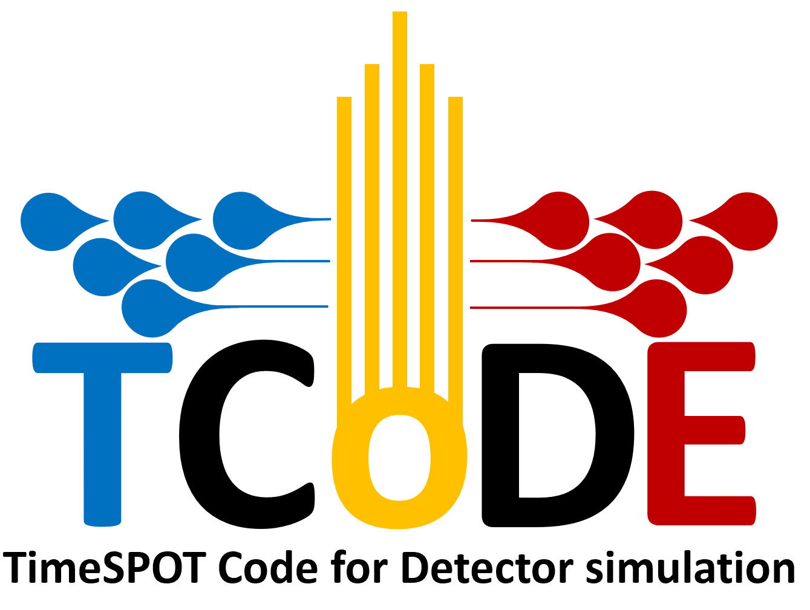

[](https://zenodo.org/badge/latestdoi/164617844)



## What is it?
TCode is a C++14 compliant application to simulate the response of solid state sensors in massively parallel platforms on Linux systems. TCode is implemented on top of [Hydra](https://github.com/MultithreadCorner/Hydra) and as such, it can run on OpenMP, CUDA and TBB compatible devices. 
TCode is still in its alpha version and the repository it is taking shape, for the moment we focused on getting raw performance and will make more stable and user friendly release in the near future.

## How it works
TCode uses external 3D maps of electric fields, carrier mobilities and weighting field and energy deposit to simulate the response in current of solid state sensors. The motion of the individual carriers produced in the initial deposit is determined using a 4th other Runge-Kutta using the electric field and the mobilities and assuming that the carriers always move at drift velocity. At each time interval the current induced in the electrod is calculated from the carriers velocity using the corresponding weighting field, according to the [Shockley](https://aip.scitation.org/doi/10.1063/1.1710367)-[Ramo](https://ieeexplore.ieee.org/document/1686997) theorem. The output is stored to ROOT files, several level of output detail are available, from the simple current vs time plot to the complete information about the position of the carriers at each time step.

## Dependencies
TCode depends on [ROOT >= v.6.14](https://github.com/root-project/root), [libconfig >= v1.5](https://hyperrealm.github.io/libconfig/), [TCLAP >= v1.2.1](http://tclap.sourceforge.net/) and optionally  [CUDA >= 10.0](https://developer.nvidia.com/cuda-toolkit) (needed for nVidia GPUs).

## Manual
### Parameter file
Every simulation is set by defining its parameters on the configuration file. Each configuration file has 3 main sections:
1. OutputDirectory: This output sets the folder where all the results of the simulations will be stored
   `OutputDirectory = "/path/to/output"`
3. PhysicsMaps: This section contains the paths where the physics maps are stored. It is possibile to call a single physics file which contains all needed physics or 4 different files which contains the electric field (efield), wheighting field (wfield), electron mobility (emob) and hole mobility (hmob).
   ```
   PhysicsMaps:{
     efield  =  "path/to/efield_map"
     wfield  =  "path/to/wfield_map"
     emob    =  "path/to/emob_map"
     hmob    =  "path/to/hmob_map"
   }
   ```
   The alternative with the all-physics maps is called with the keyword `map`:
   ```
   PhysicsMaps:{
     map  =  "path/to/physics_map"
   }
   ```
5. InputData: This section sets the name of every single simulation, its parameters like the timestep and the number of time steps. Furthermore InputData defines the energy deposit and how it is build. 
   ```
   InputData:
   {
      SimulationName:
      {
      name       = "SimulationName";
      steps      = 100;
      timestep   = 1e-12;
      plot       = false;
      process    = true;
      extrainfo  = false;
      T          = 300.;
      group      = 1;
      path       = "path/to/energyDeposit.dat"
      customdeposit = "NO";
      particles  = 0;
      Xshift     = 2.;
      Yshift     = 2.;
      Zshift     = 0.;
      Length     = 100.;
      BunchSize  = 600; 
      }
   }
   ```
### The parameters
1. `name`(string):    is the nickname for the simulation
2. `path`(string):    indicates the path where the specifications of the energy deposit are located
3. `plot`(bool):      if `true` generates a gif containing charge drift and signal plotting (timeconsuming!)
4. `extrainfo`(bool): generates snapshots for all simulation steps (timeconsuming!)
5. `steps`:           Indicates the number of timesteps required to run the transient simulation
6. `timestep`:        Is the minimum advancement in time requested for the transient simulation
7. `particles`:       Is the number of particles requested for the dummy deposit (if path is activated, particles does not work).
8. `X/Y/Zshift`:      Allows to shift (in micrometres) the energy deposit (imported or dummy).
9. `Length`:          Lenght of the dummy deposit (does not work if path activated).
10. `group`:          Allows group a large number of electron hole pairs. 
## Authors
TCode was created by [Andrea Contu](https://github.com/acontu) and [Angelo Loi](https://github.com/angeloloi19).

## Acknowledgement
TCode was developed within the TIMESPOT collaboration, supported by the [Instituto Nazionale di Fisica Nucleare (INFN)](http://home.infn.it/en/) and by the [Università degli Studi di Cagliari](https://www.unica.it/unica/).
